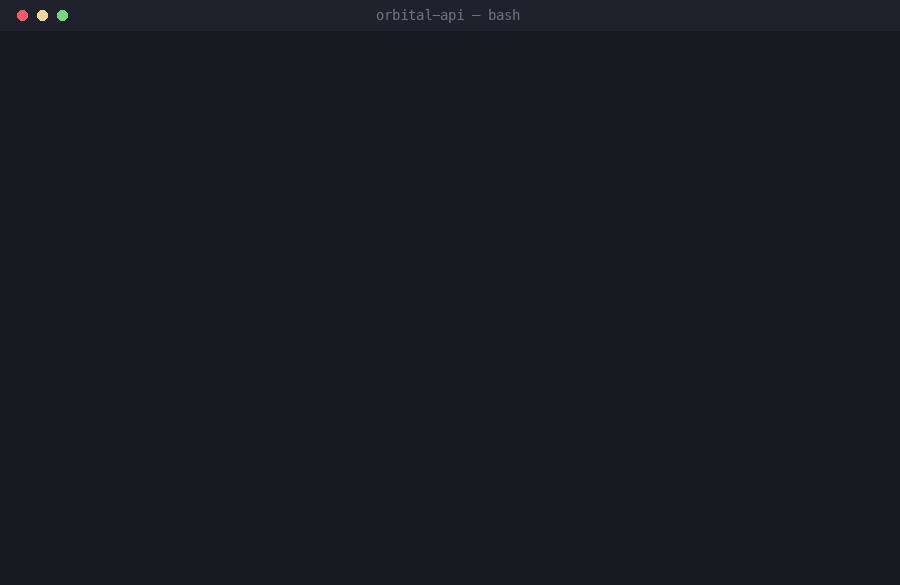

<p align="center">
  <strong>Nothing learned is lost. Nothing learned has to be re-learned.</strong>
</p>

<p align="center">
  A knowledge-maintenance pass for the end of an agent session — so the next one starts smarter.
</p>

<p align="center">
  <a href="LICENSE"></a>
  
  
</p>

<p align="center">
  
</p>

---

## The loop

An agent starts every session from nothing except the artifacts it can re-read. So the quality of
those artifacts *is* the quality of your next session.

Left alone, they decay in both directions at once. The useful things you worked out get lost —
decided in conversation, never written down. And the things that *do* get written accumulate until
the rules file is too long to re-read and the status doc is too unreliable to trust.

`wrap-up` closes that loop deliberately, once, at the end of a session:

```
    ┌─ session ──────────────────────────────────────────┐
    │  decisions made · corrections given · mistakes     │
    │  found · questions answered · notes half-captured  │
    └───────────────────────┬────────────────────────────┘
                            │
                       wrap up
                            │
    ① probe   the queues + gate, before trusting memory
    ② extract only what outlives the session
    ③ route   each item to the home that gets read at the right moment
    ④ consolidate  so the always-loaded files stay re-readable
    ⑤ refresh the entry point the next session reads first
    ⑥ verify  every write, and say what you deliberately skipped
                            │
    ┌───────────────────────▼────────────────────────────┐
    │  next session: already knows. doesn't re-ask,      │
    │  doesn't re-decide, doesn't repeat the mistake.    │
    └────────────────────────────────────────────────────┘
```

That is the whole product. Everything below is how each step earns its place.

## What it actually does

**① Probes before it recalls.**
"Reflect on the session" is the least reliable input a wrap-up has. The valuable items are usually
already sitting somewhere: a note captured mid-session and never filed, a task marked *done* whose
evidence doesn't support it, a task marked *dropped* with no reason recorded — indistinguishable from
an accident. So it runs your inbox and your validator *first*, and reflects second.

**② Extracts durable signal, not events.**
Preferences and corrections ("do it this way, not that way"). Decisions with their rationale.
Recurring friction worth automating. Open loops. Stale artifacts. It deliberately skips transient
task detail, one-off wording, and anything already recorded accurately.

**③ Routes by role, not by filename.**
It works from seven roles — instruction store, memory index, entry point, decision store, reference
store, pending queue, gate — and discovers how *your* project implements each. A decision goes where
decisions are found. A preference goes where behaviour is set. A person-specific note never goes
somewhere shared. If a role doesn't exist in your project, it says so instead of inventing a file.

**④ Consolidates instead of accumulating.**
The test is **auto-loaded vs retrieved-on-purpose**. A 300-line rules file injected into every
session and every subagent costs you on every request forever; a 3,000-line reference someone opens
deliberately costs nothing until it's needed. Those shouldn't obey the same rule — so it consolidates
hard on the first and relaxes on the second. Retiring a superseded rule counts as a win.

**⑤ Turns mistakes into triggers, not stories.**
Anything you or the agent got wrong is written as **TRIGGER → REQUIRED CHECK → FAILURE PREVENTED**.
A rule that names its trigger actually fires at the moment it's needed. A lesson just sits there
being true. Related: weak signal gets a **review date**, not a rule — one occurrence isn't a pattern,
and wrap-up is exactly where an inference gets quietly promoted to a fact.

**⑥ Leaves the entry point true, and verifies.**
The last thing it touches is the first thing the next session reads — because a stale reference doc
is a dead end the reader notices, while a stale *status* doc is worse than missing: it's
authoritative, and it gets acted on. It re-checks asserted numbers against live data, **including
blocks labelled auto-generated** (a generator not actually wired into a schedule drifts silently,
and its own comments will still promise it can't). Then it re-runs your gate, confirms pointers
resolve, checks the diff scope, and reports what it deliberately did *not* persist.

## Who it's for

| You | What you get |
|---|---|
| **Solo, small project** | The agent stops re-asking things you already settled, and your rules file stays short enough that you still read it |
| **Long-running project** | Decisions stay findable with their rationale, so old questions don't get re-litigated six weeks later |
| **A team** | A handoff document people actually trust, and onboarding that doesn't depend on one person's memory |
| **Non-code work** — research, ops, writing, planning | The loop is about knowledge, not code. Roles map to whatever you already keep |
| **No `CLAUDE.md`, no validator, nothing set up** | It works from whatever exists, tells you which roles are missing, and never fabricates a file to fill a gap |

## Install

```
/plugin marketplace add goagrawal-genai/wrap-up
/plugin install wrap-up
```

Then, at the end of a session:

```
wrap up
```

Or invoke it directly with `/wrap-up`. It also answers to *close out*, *hand off*, *checkpoint*, and
*capture what we learned*.

It won't do a full pass after routine work with nothing durable in it — a short status summary is
often the correct answer, and it will say so.

## Safety and scope

- **Your project's rules outrank this skill.** It reads them first and defers to them.
- **Narrowest valid scope.** It won't promote project-confidential material into a global or shared
  store just because that store is convenient.
- **Never claims persistence that didn't happen.** Verified writes only. Where it can't write at all,
  it says so and hands you a paste-able proposal instead of narrating a save.
- **It never publishes, pushes or syncs.** Committing is offered, never assumed, with paths staged
  explicitly.

## Design notes

Longer-form reasoning — including which "obvious" improvements were deliberately rejected and why —
is in [`docs/design-rationale.md`](docs/design-rationale.md). Short version: a skill is read by a
model with judgment, not executed by a runtime, so typed schemas, confidence scores on prose, and
prompt-level "transactions" cost more than they return.

The skill is deliberately short enough to re-read. **A skill too long to re-read gets skimmed** —
which is the exact failure it exists to prevent.

## Contributing

Issues and PRs welcome, especially **failure modes you've hit in the wild.** The "Failure modes"
table inside the skill is the most useful part of it, and it only grows from real reports.

## License

MIT — see [LICENSE](LICENSE).
